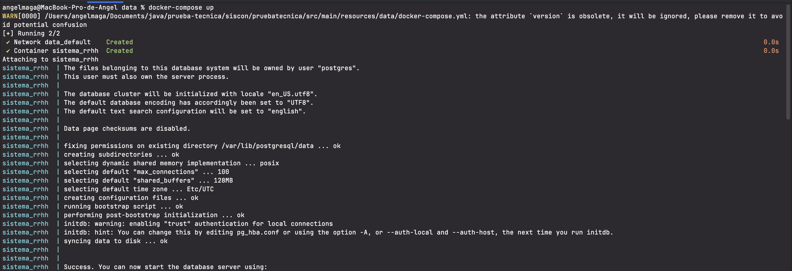

# Prueba Técnica 

1) Descargar el proyecto.
2) Abrir una terminal ya sea en el editor o de su preferencia y posicionarse en la carpeta "src/main/resources/data"
3) DEscargar la imagen de postgres:latest // docker pull postgres:latest
4) Ejecutar el siguiente comando docker-compose up 
5) Abrir la colección de postman 
    - ejecutar el request "save-employee"
    - ejecutar los siguientes request en el orden deseado
6) Se adjunta evidencia del correcto funcionamiento

### Coverage
Se utilizó Jacoco 

### Swagger
Colocar en el buscador http://localhost:8080/employees/swagger-ui/index.html#/employees-controller/getOrderById
Para poder ver el contrato
